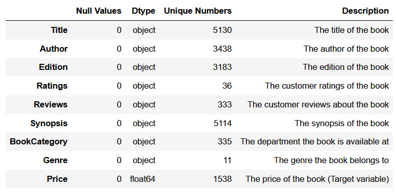
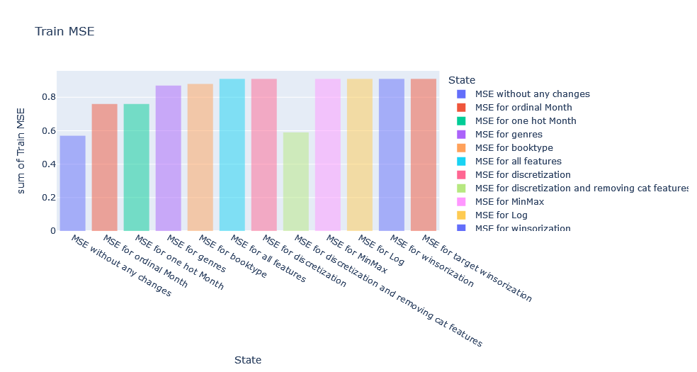
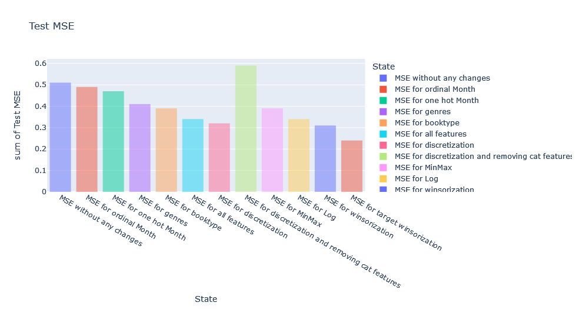
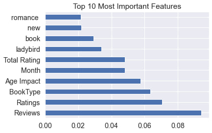

# Book Prices Prediction
## Contents
### Data Understanding
Understanding data and features

### Data Cleaning For EDA
* Renaming columns
* Categorical to numerical 
* Feature expansion
* Feature extraction
* Null values handling

### Exploratory Data Analysis
* Univariate Analysis
  * Target analysis
  * Numerical features
  * Categorical features

* Bivariate Analysis
  * Year analysis
  * Population analysis
  * Price analysis

### Data Preprocessing
* Target Log
* Encoding
    * Ordinal
    * One Hot
    * Count Vectorizer

* Discretization
* Normalization
* Scaling
* Standardization
* Outlier Detection

### Modeling
Random forest regressor is used.

### Evaluation
MSE for train and test datasets
* Train MSE
* 

* Test MSE
* 

### Feature Importance
